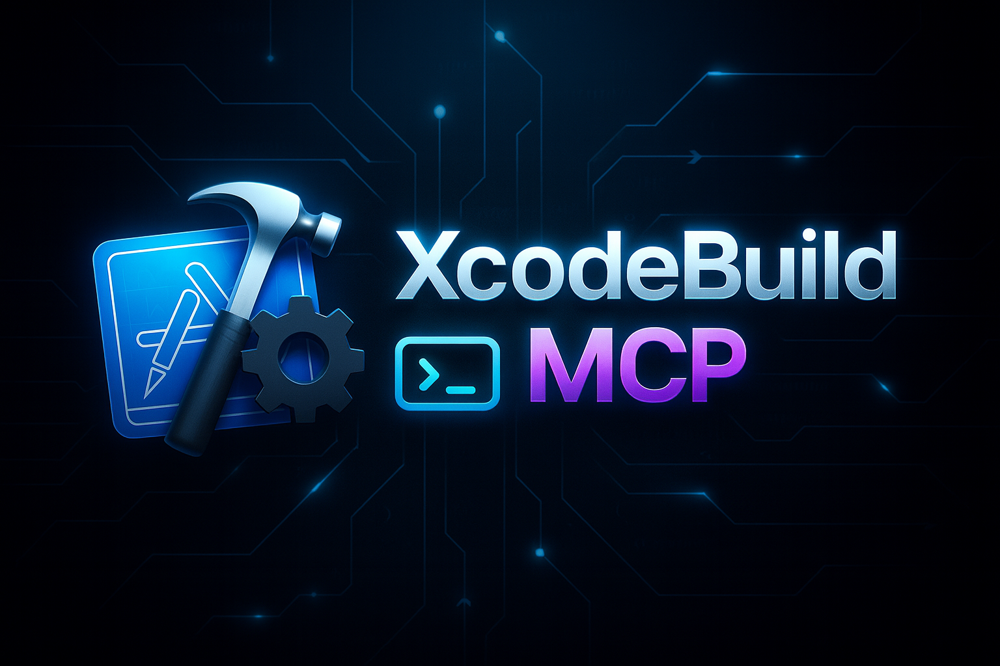

A Model Context Protocol (MCP) server that provides Xcode-related tools for integration with AI assistants and other MCP clients.

[](https://github.com/cameroncooke/XcodeBuildMCP/actions/workflows/ci.yml)
[](https://badge.fury.io/js/xcodebuildmcp) [](https://opensource.org/licenses/MIT) [](https://nodejs.org/) [](https://developer.apple.com/xcode/) [](https://www.apple.com/macos/) [](https://modelcontextprotocol.io/) [](https://deepwiki.com/cameroncooke/XcodeBuildMCP)

## Installation

Add XcodeBuildMCP to your MCP client configuration. Most clients use JSON configuration with the following server entry:

```json
"XcodeBuildMCP": {
  "command": "npx",
  "args": ["-y", "xcodebuildmcp@latest", "mcp"]
}
```

<details>
  <summary>Cursor</summary>
  <br />

  Add to `~/.cursor/mcp.json`:
  ```json
  {
    "mcpServers": {
      "XcodeBuildMCP": {
        "command": "npx",
        "args": ["-y", "xcodebuildmcp@latest", "mcp"]
      }
    }
  }
  ```

  Or use the quick install link:

  [](cursor://anysphere.cursor-deeplink/mcp/install?name=XcodeBuildMCP&config=eyJjb21tYW5kIjoibnB4IiwiYXJncyI6WyIteSIsInhjb2RlYnVpbGRtY3BAbGF0ZXN0IiwibWNwIl19)
  <br />
</details>

<details>
  <summary>Claude Code</summary>
  <br />

  Run:
  ```bash
  claude mcp add XcodeBuildMCP -- npx -y xcodebuildmcp@latest mcp
  ```
  <br />
</details>

<details>
  <summary>Codex CLI</summary>
  <br />

  Run:
  ```bash
  codex mcp add XcodeBuildMCP -- npx -y xcodebuildmcp@latest mcp
  ```

  Or add to `~/.codex/config.toml`:
  ```toml
  [mcp_servers.XcodeBuildMCP]
  command = "npx"
  args = ["-y", "xcodebuildmcp@latest", "mcp"]
  ```
  <br />
</details>

<details>
  <summary>Claude Desktop</summary>
  <br />

  Add to `~/Library/Application Support/Claude/claude_desktop_config.json`:
  ```json
  {
    "mcpServers": {
      "XcodeBuildMCP": {
        "command": "npx",
        "args": ["-y", "xcodebuildmcp@latest", "mcp"]
      }
    }
  }
  ```
  <br />
</details>

<details>
  <summary>VS Code / VS Code Insiders</summary>
  <br />

  Add to your VS Code settings JSON:
  ```json
  "mcp": {
    "servers": {
      "XcodeBuildMCP": {
        "command": "npx",
        "args": ["-y", "xcodebuildmcp@latest", "mcp"]
      }
    }
  }
  ```

  Or use the quick install links:

  [](https://insiders.vscode.dev/redirect/mcp/install?name=XcodeBuildMCP&config=%7B%22command%22%3A%22npx%22%2C%22args%22%3A%5B%22-y%22%2C%22xcodebuildmcp%40latest%22%2C%22mcp%22%5D%7D)
  [](https://insiders.vscode.dev/redirect/mcp/install?name=XcodeBuildMCP&config=%7B%22command%22%3A%22npx%22%2C%22args%22%3A%5B%22-y%22%2C%22xcodebuildmcp%40latest%22%2C%22mcp%22%5D%7D&quality=insiders)
  <br />
</details>

<details>
  <summary>Windsurf</summary>
  <br />

  Add to `~/.codeium/windsurf/mcp_config.json`:
  ```json
  {
    "mcpServers": {
      "XcodeBuildMCP": {
        "command": "npx",
        "args": ["-y", "xcodebuildmcp@latest", "mcp"]
      }
    }
  }
  ```
  <br />
</details>

<details>
  <summary>Trae</summary>
  <br />

  Add to `~/Library/Application Support/Trae/User/mcp.json`:
  ```json
  {
    "mcpServers": {
      "XcodeBuildMCP": {
        "command": "npx",
        "args": ["-y", "xcodebuildmcp@latest", "mcp"]
      }
    }
  }
  ```
  <br />
</details>

<br />

For other installation options see [Getting Started](docs/GETTING_STARTED.md)

When configuring a client manually, ensure the command includes the `mcp` subcommand (for example, `npx -y xcodebuildmcp@latest mcp`).

## Requirements

- macOS 14.5 or later
- Xcode 16.x or later
- Node.js 18.x or later

## Skill

XcodeBuildMCP now includes an optional agent skill. Some clients (e.g., Cursor, Claude Code) hide MCP tool schemas behind search/progressive disclosure, which can reduce tool discovery and usage. The skill provides a concise overview of available tools to counter that. If your client already exposes tools up front, you likely don’t need it; only use it if your agent isn’t reaching for XcodeBuildMCP tools.

To install, replace `<client-name>` with your client (cursor, claude, codex):
```bash
curl -fsSL https://raw.githubusercontent.com/cameroncooke/XcodeBuildMCP/main/scripts/install-skill.sh | bash -s -- --<client-name>
```

For further information on how to install the skill, see: [docs/SKILLS.md](docs/SKILLS.md)

## Notes

- XcodeBuildMCP requests xcodebuild to skip macro validation to avoid errors when building projects that use Swift Macros.
- Device tools require code signing to be configured in Xcode. See [docs/DEVICE_CODE_SIGNING.md](docs/DEVICE_CODE_SIGNING.md).

## Privacy

XcodeBuildMCP uses Sentry for error telemetry. For more information or to opt out of error telemetry see [docs/PRIVACY.md](docs/PRIVACY.md).

## CLI

XcodeBuildMCP provides a unified command-line interface. The `mcp` subcommand starts the MCP server, while all other commands provide direct terminal access to tools:

```bash
# Install globally
npm install -g xcodebuildmcp

# Start the MCP server (for MCP clients)
xcodebuildmcp mcp

# List available tools
xcodebuildmcp tools

# Build for simulator
xcodebuildmcp build-sim --scheme MyApp --project-path ./MyApp.xcodeproj
```

The CLI uses a per-workspace daemon for stateful operations (log capture, debugging, etc.) that auto-starts when needed. See [docs/CLI.md](docs/CLI.md) for full documentation.

## Documentation

- Getting started: [docs/GETTING_STARTED.md](docs/GETTING_STARTED.md)
- CLI usage: [docs/CLI.md](docs/CLI.md)
- Configuration and options: [docs/CONFIGURATION.md](docs/CONFIGURATION.md)
- Tools reference: [docs/TOOLS.md](docs/TOOLS.md)
- Troubleshooting: [docs/TROUBLESHOOTING.md](docs/TROUBLESHOOTING.md)
- Privacy: [docs/PRIVACY.md](docs/PRIVACY.md)
- Skills: [docs/SKILLS.md](docs/SKILLS.md)
- Contributing: [docs/dev/CONTRIBUTING.md](docs/dev/CONTRIBUTING.md)

## Licence

This project is licensed under the MIT License - see the [LICENSE](LICENSE) file for details.
