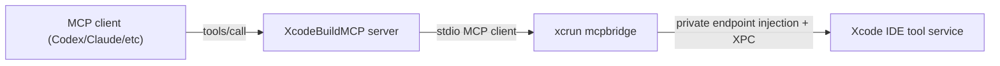

# Xcode IDE MCP Bridge Plan (Xcode 26.x `xcrun mcpbridge`)

This document is an implementation plan to extend XcodeBuildMCP by optionally proxying Apple Xcode’s “Xcode Tools” MCP service through `xcrun mcpbridge`.

## Goal

Add an **optional** workflow to XcodeBuildMCP that:

- Detects whether `xcrun mcpbridge` is available.
- If available and enabled, starts a long-lived `mcpbridge` child process.
- Connects to it as an **MCP client** over stdio.
- Discovers Xcode’s advertised tools (`tools/list`) and listens for tool list changes (`tools/listChanged`).
- Dynamically registers proxied tools in XcodeBuildMCP and forwards calls to Xcode through the bridge.
- Handles tool catalog changes over time without breaking XcodeBuildMCP.

Non-goals:

- Reverse engineering Xcode’s internal XPC transport (we rely on Apple’s `mcpbridge` for that).
- Keeping a stable, curated wrapper API for Xcode tools (we proxy dynamically; stability is best-effort).

## Why This Is Worth Doing (Capabilities We Gain)

XcodeBuildMCP is currently strongest at `xcodebuild` + simulator/device workflows. The Xcode IDE MCP service provides **IDE-only** capabilities that `xcodebuild` cannot:

- SwiftUI Preview rendering to an image (`RenderPreview`).
- Issue Navigator issues (including workspace/package resolution problems) (`XcodeListNavigatorIssues`).
- “Refresh code issues for file” style diagnostics (`XcodeRefreshCodeIssuesInFile`).
- Apple Developer Documentation semantic search (`DocumentationSearch`).
- Execute code snippets in file context (`ExecuteSnippet`).
- Project navigator operations on **Xcode project structure**, not raw filesystem (`XcodeLS`, `XcodeGlob`, `XcodeGrep`, `XcodeRead`, `XcodeWrite`, `XcodeUpdate`, `XcodeMV`, `XcodeRM`, `XcodeMakeDir`).
- IDE-scoped build/test orchestration and richer result structures (`BuildProject`, `GetBuildLog`, `GetTestList`, `RunAllTests`, `RunSomeTests`).
- Xcode window/tab discovery to obtain `tabIdentifier` (`XcodeListWindows`).

This complements XcodeBuildMCP rather than replacing it.

## Observed Bridge Behavior (Local Probing)

- `xcrun --find mcpbridge` resolves to Xcode’s bundled binary:
  - `/Applications/Xcode.app/Contents/Developer/usr/bin/mcpbridge`
- The bridge is a stdio JSON-RPC server that speaks MCP.
- Initialization works with MCP protocol version `2024-11-05` and server reports:
  - `serverInfo.name = "xcode-tools"`
  - `capabilities.tools.listChanged = true`
- `tools/call` works (e.g. calling `XcodeListWindows` returned a `tabIdentifier` and workspace path).
- Xcode may show “trust/allow client prompts” when the bridge connects and/or when tools are invoked. This plan avoids noisy retry loops to reduce prompt spam.

## Proposed Architecture



Key choice: **XcodeBuildMCP remains the server**. When the optional workflow is enabled, it embeds an internal MCP client to Xcode’s tool service via `mcpbridge`.

## Tool Naming / Collision Strategy

Expose proxied tools with a clear prefix:

- Local tool name: `xcode_tools_<RemoteToolName>`
- Example: `xcode_tools_XcodeListWindows`

Rationale:

- Avoid collisions with existing XcodeBuildMCP tools.
- Make provenance explicit for agents.

## Safety Policy

Proxy **all tools** that Xcode advertises (including mutating tools like `XcodeWrite`, `XcodeUpdate`, `XcodeRM`), as requested.

Mitigations:

- Keep the prefix (`xcode_tools_`) so call sites can easily reason about what they’re invoking.
- Add an `annotations.readOnlyHint` best-effort heuristic (mutators get `false`).
- Add clear documentation that these are IDE-scoped filesystem/project mutations.

## Workflow / Enablement

Add a new workflow group:

- Directory: `src/mcp/tools/xcode-ide/`
- Workflow name: `xcode-ide`

Enablement is via existing workflow selection (`enabledWorkflows`), e.g.:

```yaml
schemaVersion: 1
enabledWorkflows: ["simulator", "debugging", "xcode-ide"]
```

Behavior:

- If `xcode-ide` workflow is not enabled, no bridge code runs.
- If enabled but `mcpbridge` is missing/unusable, we register **only** small “bridge management” tools (status + manual sync) and no proxied tools.
- If enabled and bridge is healthy, we dynamically register proxied tools based on `tools/list`.

## Internal Modules To Add

New directory:

- `src/integrations/xcode-tools-bridge/`

### `client.ts`

Responsibilities:

- Spawn `xcrun mcpbridge` using `StdioClientTransport` (`@modelcontextprotocol/sdk` client).
- Provide `connectOnce()`, `disconnect()`, `listTools()`, and `callTool(name,args)`.
- Apply request timeouts (avoid hanging forever when Xcode prompts).
- Listen for `tools/listChanged` notifications and trigger a re-sync.

Environment plumbing:

- Optional `XCODEBUILDMCP_XCODE_PID` -> `MCP_XCODE_PID`
- Optional `XCODEBUILDMCP_XCODE_SESSION_ID` -> `MCP_XCODE_SESSION_ID`

### `jsonschema-to-zod.ts`

Convert Xcode tool JSON Schemas to Zod shapes for XcodeBuildMCP’s `server.registerTool`.

Support a pragmatic subset (covers the schema you provided):

- `type: object` with `properties`, `required`
- primitives: `string`, `integer`, `number`, `boolean`
- `enum`
- `type: array` with `items`

Forward-compat strategy:

- Unknown constructs fall back to `z.any()` for that property.
- Top-level object schemas are `passthrough()` to tolerate added fields without breaking.

### `registry.ts`

Responsibilities:

- Maintain a mapping of remote tool -> registered local tool.
- Given latest `tools/list`:
  - Register new tools.
  - Update tools when schema/metadata changes (remove + re-register).
  - Remove tools no longer present.
- Proxy handler behavior:
  - `xcode_tools_<Remote>` simply forwards to `tools/call` on the bridge client.

## MCP Tooling Added by XcodeBuildMCP (Bridge Management)

These are non-proxied, always-stable tools in the `xcode-ide` workflow:

- `xcode_tools_bridge_status`
  - Returns availability/health:
    - whether `xcrun` can find `mcpbridge`
    - whether Xcode is running (optional hint)
    - connection status, last error, number of proxied tools currently registered
    - current pid/session id used (if any)
- `xcode_tools_bridge_sync`
  - One-shot connect + tool sync attempt (manual retry; avoids background prompt spam)
- Optional: `xcode_tools_bridge_disconnect`
  - Stop bridge and unregister proxied tools

## Bootstrap / Lifecycle Integration

Entry point:

- `src/server/bootstrap.ts` after `registerWorkflows(enabledWorkflows)`:
  - If `xcode-ide` is enabled, start bridge `connectOnce()` and attempt tool sync.

Shutdown:

- `src/server/start-mcp-server.ts` SIGINT/SIGTERM handlers:
  - Disconnect bridge cleanly before closing server.

Failure modes:

- Bridge process exits unexpectedly:
  - Unregister proxied tools.
  - Status tool reports last error.
  - Manual sync tool can be used to retry.

## Handling Tool Catalog Changes Over Time

- Use `tools/list` as source of truth on connect.
- Subscribe to list-changed (`tools.listChanged = true` is advertised by server) and re-sync on change.
- Do not assume tool names are stable; tool proxy registry is dynamic.
- Zod schema conversion is best-effort and permissive (`passthrough`, `z.any()` fallback) to avoid breaking when Apple extends schemas.

## Testing Strategy

### Unit tests (Vitest)

- JSON Schema -> Zod conversion:
  - object/required/enum/array nesting cases based on the provided schema.
  - unknown schema constructs degrade to `z.any()`.

### Integration tests (no Xcode required)

- Fake MCP server over stdio that:
  - supports `initialize`, `tools/list`, `tools/call`
  - emits a `tools/listChanged` notification
- Validate:
  - proxied tools register with correct `xcode_tools_` prefix
  - tool calls forward correctly
  - list-changed causes add/remove/re-register

### Manual “real Xcode” probe (repeatable)

Add a script:

- `scripts/probe-xcode-mcpbridge.ts`
  - connects to `xcrun mcpbridge`
  - prints server info + tool count + first N tool names
  - calls `XcodeListWindows` and prints discovered `tabIdentifier`s

This should be used during dev because Xcode prompts are human-mediated and not CI-friendly.

## Documentation Updates

- New doc:
  - `docs/XCODE_IDE_MCPBRIDGE.md` (user-facing-ish)
    - how to enable `xcode-ide`
    - how `tabIdentifier` works
    - how to troubleshoot trust prompts and missing tools
- Update:
  - `docs/TOOLS.md` to include `xcode-ide` workflow and stable bridge tools
  - Document that proxied tools are dynamic and appear as `xcode_tools_*`.

## Acceptance Criteria

- With `xcode-ide` enabled and Xcode running:
  - XcodeBuildMCP registers `xcode_tools_<ToolName>` for all tools returned by `tools/list`.
  - Calling a proxied tool forwards to Xcode and returns the result content unchanged.
- With `xcode-ide` enabled and no bridge available:
  - Only `xcode_tools_bridge_status` and `xcode_tools_bridge_sync` are present.
  - Server startup remains healthy.
- If Xcode updates the tool catalog while running:
  - proxied tool set updates without server restart.

